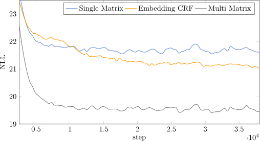

# Embedding-based Contextual CRF

Output and code for the paper

&nbsp;&nbsp;&nbsp;&nbsp;&nbsp;&nbsp; [Autoregressive Text Generation Beyond Feedback Loops](https://arxiv.org/abs/1908.11658)          
&nbsp;&nbsp;&nbsp;&nbsp;&nbsp;&nbsp; _Florian Schmidt, Stephan Mandt, Thomas Hofmann_

presented at EMNLP 2019.


## Evaluation n-gram models

The n-gram models estimated on the SNLI corpus [1] used for evaluation were created using the [SRILM](http://www.speech.sri.com/projects/srilm) [2] language modeling toolbox. The Kneser–Ney smoothed 2-gram and 3-gram models used in the paper can be found under [n-gram-models](n-gram-models/).

With SRILM installed, one can evaluate generated output on the console like
```console
ngram -lm n-gram-models/snli.2gram.lm -ppl generated-text/ssm-crf
```
to obtain `ppl=40.1` as reported in Table 2, first row, first column.

## Generated output

We provide 100K sentences for every model evaluated under [generated-text](generated-text/).

# Code

## Pairwise Potentials in CRFs
Typically, the pairwise potentials in CRFs are parametrized by a single `VxV` matrix where `V` is the vocabulary (size). While this might be sufficient for data with little position-dependent correlations, text data requires interactions to change across time (think of a dot at the end of the sentence). In principle, this can be achieved by using a `LxVxV` tensor of potentials where `L` is the sequence length. However, `VxV` (and `LxVxV` in particular) are typically too large to be stored explicitly and `L` might not be known a priori. Our approach addresses both shortcomings.

## Implemented Functionality
We provide a CRF implementation of the proposed embedding-based contextual parametrization of pairwise potentials (Equations (9)) and the algorithm for sampling from the CRF (Equations (6) - (7)). That is, _given a sequence of `d`-dimensional states `Lxd`, model the distribution across sequences of length `L` with tokens from the vocabulary `V`_, formally:

&nbsp;&nbsp;&nbsp;&nbsp;&nbsp;&nbsp; 

Note that the states are _not_ generated by the CRF itself. Depending on the application, they can be stochastic latent states or deterministic feature vectors.

#### Comparison with other models and implementations

For reference, we also provide implementations for non-factorized pairwise potentials in the same framework, yet without some performance optimizations that are possible in these cases. Tensorflow's built-in CRF algorithms are located under [tfa.text.crf](https://www.tensorflow.org/addons/api_docs/python/tfa/text/crf) and our implementation is based on theirs. The following table compares the two. Brackets indicate that the functionality is implemented, yet only for demonstration on very simple data as some approaches require a lot of memory.

| | tensorflow | ours |
| ------------- |:-------------:| -----:|
| identical potentials | yes | (yes) |
| per-timestep potentials | no | (yes) |
| per-timestep factorized potentials | no | yes |
| sampling | no | yes |

#### Compatibility

The code is written against tensorflow 1.13.1 and tensorflow-probability 0.6.0. A Keras-backed tensorflow 2.0 implementation of tensorflow's own CRF library is [in the works](https://github.com/tensorflow/addons/pull/377) for quite a while. We will evaluate the potential of updating our code to 2.0. once this process has been finalized.


## Minimal Example
### Toy Language
To showcase the model and implementation, we generate some simple toy sequence data from a probabilistic procedure (see [toy_language.py](toy_language.py)) to be able to compare against the - otherwise infeasible - models with non-factorized potentials. Our language consists of first non-decreasing then non-increasing sequences generated with a uniform distribution across allowed symbols and a position-dependent repetition probability. Examples are:

```4 4 4 4 4 7 7 8 8 10 15 15 15 15 12 8 8 8 8 6
seq1 = 7 11 17 17 17 17 17 18 18 19 19 19 19 19 19 17 11 9 7 0
seq2 = 3 12 12 12 14 15 17 18 19 19 19 19 19 18 18 17 17 8 0 0
seq3 = 1 5 8 8 8 8 8 8 10 10 19 17 15 15 11 3 3 3 3 1
seq4 = 8 8 8 12 12 14 14 19 19 19 15 15 10 9 8 5 0 0 0 0
```

The result is a language that exhibits pairwise position-specific correlations.

### Architecture
To simplify the overall architecture we choose fixed positional encodings as 'hidden' states. We compare our _Embedding CRF_ against _Single Matrix_, which uses a single `V x V` matrix, and _Multi Matrix_, which uses `L` such matrices, and finally `Softmax` which uses an identical soft-max in every timestep.

### Experiments
Running
```
python3 train.py --model_dir out/tf-crf --model tf-crf 
python3 train.py --model_dir out/emb-crf --model emb-crf\
                      --crf_pretrained_embedding emb-V20-L20.asym.w2.100d.glove
python3 train.py --model_dir out/multi --model emb-crf --crf_transitions multi-matrix 

```
trains the three models. Training loss is plotted in tensorboard, test loss is printed on std out. The figure below shows the result.



Having contextual potentials pays off after the initial 10K steps and clearly outperforms the standard (tensorflow) CRF. Not surprisingly, the factorization and the variable sharing across time do incur a performance loss when compared to the _Multi_ CRF with its `LxVxV` parameters.  However, for any `L` and `V` found in a real dataset, the _Multi_ model will likely not fit onto a GPU.


[1] https://nlp.stanford.edu/projects/snli/     
[2] http://www.speech.sri.com/projects/srilm/papers/icslp2002-srilm.pdf


